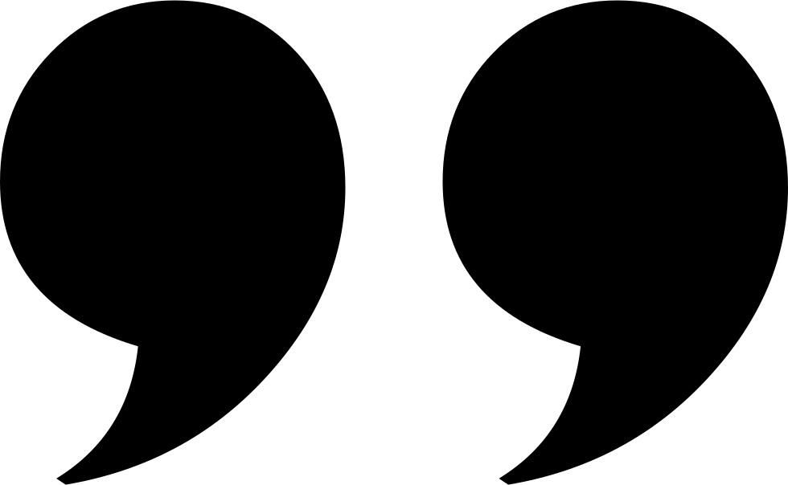

<a name="readme-top"></a>


<!-- PROJECT SHIELDS -->
[![Issues][issues-shield]][issues-url]
[![MIT License][license-shield]][license-url]
[![LinkedIn][linkedin-shield]][linkedin-url]


<!-- PROJECT LOGO -->
<br />
<div align="center">
  <a href="https://github.com/dscpsyl/quotebot">
    
  </a>

<h3 align="center">Discord QuoteBot</h3>

  <p align="center">
    Discord banter to keep forever
    <br />
    <a href="https://github.com/dscpsyl/quotebot/issues">Report Bug</a>
    ·
    <a href="https://github.com/dscpsyl/quotebot/issues">Request Feature</a>
  </p>
</div>


<!-- TABLE OF CONTENTS -->
<details>
  <summary>Table of Contents</summary>
  <ol>
    <li>
      <a href="#about-the-project">About The Project</a>
    </li>
    <li>
      <a href="#getting-started">Getting Started</a>
      <ul>
        <li><a href="#prerequisites">Prerequisites</a></li>
        <li><a href="#installation">Installation</a></li>
      </ul>
    </li>
    <li><a href="#usage">Usage</a></li>
    <li><a href="#contributing">Contributing</a></li>
    <li><a href="#license">License</a></li>
  </ol>
</details>


<!-- ABOUT THE PROJECT -->
## About The Project

A simple Discord Bot that takes an input and stores it with data in a MongoDB for future searches and to forever hold your favorite memories with your friends. 

<p align="right">(<a href="#readme-top">back to top</a>)</p>


<!-- GETTING STARTED -->
## Getting Started

This bot requires selfhosting and NO external hosting is provided. A simple home server or RaspberryPi is more than enough for this program.

### Prerequisites

You must have a Discord app key and token ready for your bot before you begin. You may setup a developer account and create an application with discord by reading their [docs](https://discord.com/developers/docs/intro).
<br />

You also must have a presistant instance of MongoDB installed and running somewhere that can be connected to. The script assumes it is on the local machine with the default port configuations. 

#### Python Dependencies
1. python3.7>=
2. discordpy
3. pymongo
4. json

### Installation

1. Start by cloning this repository
2. Fill out the `settingsex.json` file with the required information and change it to `settings.json`
3. Start up the MongoDB instance
4. We recomend creating a python venv to contain the dependencies of this project.
5. Enter the `Quotebot` folder and run `python3 main.py` 
6. The application will be up as long as the terminal session is active and it has a connection to discord

<p align="right">(<a href="#readme-top">back to top</a>)</p>


<!-- USAGE EXAMPLES -->
## Usage

The format for a command is `{Prefix} "{QUOTE}" {Tag}`. The default prefix of the bot is `"q`.
<br />

Ex. 

```
"q "This is my quote" @userinmyserver
```


<p align="right">(<a href="#readme-top">back to top</a>)</p>

<!-- CONTRIBUTING -->
## Contributing

Contributions are what make the open source community such an amazing place to learn, inspire, and create. Any contributions you make are **greatly appreciated**.

If you have a suggestion that would make this better, please fork the repo and create a pull request. You can also simply open an issue with the tag "enhancement".
Don't forget to give the project a star! Thanks again!

1. Fork the Project
2. Create your Feature Branch (`git checkout -b feature/AmazingFeature`)
3. Commit your Changes (`git commit -m 'Add some AmazingFeature'`)
4. Push to the Branch (`git push origin feature/AmazingFeature`)
5. Open a Pull Request

<p align="right">(<a href="#readme-top">back to top</a>)</p>


<!-- LICENSE -->
## License

Distributed under the MIT License. See `LICENSE.txt` for more information.

<p align="right">(<a href="#readme-top">back to top</a>)</p>


<!-- MARKDOWN LINKS & IMAGES -->
<!-- https://www.markdownguide.org/basic-syntax/#reference-style-links -->
[issues-shield]: https://img.shields.io/github/issues/dscpsyl/quotebot.svg?style=for-the-badge
[issues-url]: https://github.com/dscpsyl/quotebot/issues
[license-shield]: https://img.shields.io/github/license/dscpsyl/quotebot.svg?style=for-the-badge
[license-url]: https://github.com/dscpsyl/quotebot/blob/master/LICENSE.txt
[linkedin-shield]: https://img.shields.io/badge/-LinkedIn-black.svg?style=for-the-badge&logo=linkedin&colorB=555
[linkedin-url]: https://linkedin.com/in/davidjsim


Contributors
------------------------
<a href="https://twitter.com/SimYouLater28">
     
</a>
